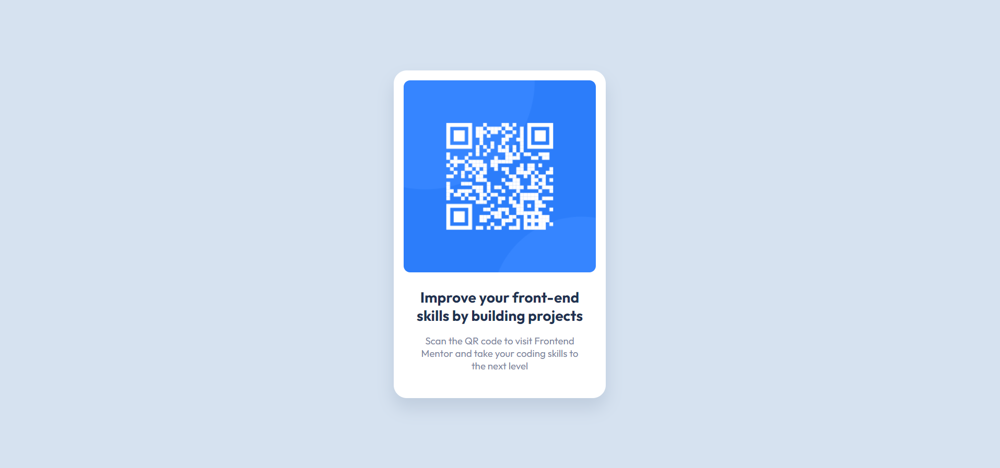

# Frontend Mentor - Four card feature section solution

This is a solution to the [QR code component challenge on Frontend Mentor](https://www.frontendmentor.io/challenges/qr-code-component-iux_sIO_H). Frontend Mentor challenges help you improve your coding skills by building realistic projects. 

## Table of contents

- [Overview](#overview)
  - [The challenge](#the-challenge)
  - [Screenshot](#screenshot)
  - [Links](#links)
- [My process](#my-process)
  - [Built with](#built-with)
- [Author](#author)

## Overview

### The challenge

Your challenge is to build out this QR code component and get it looking as close to the design as possible.

### Screenshot

### Links

- Solution URL: [https://github.com/AdrianX19/qr-code-component](https://github.com/AdrianX19/qr-code-component)
- Live Site URL: [https://adrianx19.github.io/qr-code-component/](https://adrianx19.github.io/qr-code-component/)

## My process

### Built with

- Semantic HTML5 markup
- CSS custom properties

## Author

- Frontend Mentor - [@AdrianX19](https://www.frontendmentor.io/profile/AdrianX19)